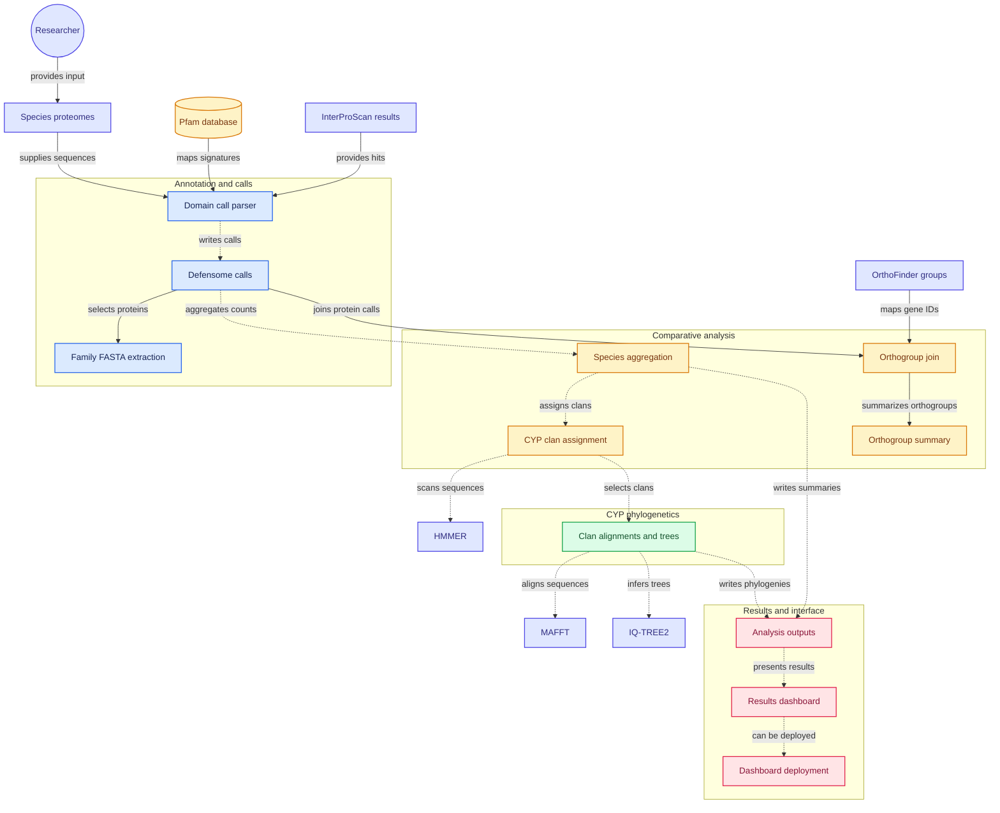

# defensome

Comparative chemical defensome annotation from proteomes. One Python file, no
install, and a single command from a directory of proteomes to an interactive
dashboard.
---

## Quick start

Check what your environment can run first. It takes a second and saves a
failed run thirty samples in:

```bash
python3 defensome.py doctor
```

If HMMER and your Python need incompatible module toolchains, which is common
on Lmod clusters, point at the binaries instead of loading both:

```bash
module load HMMER && export DEFENSOME_HMMSEARCH=$(which hmmsearch) \
                  && export DEFENSOME_HMMBUILD=$(which hmmbuild)
module purge && module load Python
```

Then:

```bash
git clone https://github.com/krishnan-Rama/DEFENSOME && cd DEFENSOME
conda env create -f envs/environment.yml && conda activate defensome

# 1. look at your proteomes; writes a draft sample sheet and stops
bash run_pipeline.sh --proteomes /path/to/proteomes --out results

# 2. check results/samplesheet.tsv, then run everything
bash run_pipeline.sh --proteomes /path/to/proteomes --pfam /db/Pfam-A.hmm \
     --out results --samplesheet results/samplesheet.tsv
```

The first run deliberately stops after `inspect`. Every silent failure this
pipeline has had came from an ID or grouping assumption nobody looked at, so
the assumption is now written to a file you have to approve.

Requirements: Python 3.9+, pandas, numpy. HMMER for `scan`; MAFFT and FastTree
for `cyp` and `trees`; scipy and matplotlib are optional and degrade with a
warning. `defensome.py` embeds its own family map and dashboard, so it runs
from any directory with no sibling files.

---

## The comparison this is built for

If you have the same species annotated more than one way, the sample sheet
turns that into a measured variable:

| sample_id | species | method | fasta | gene_regex |
|---|---|---|---|---|
| A_aura_GG_040725_okay | A_aura | genome_guided | … | `_i\d+\w*$` |
| A_aura_300725_okay | A_aura | denovo | … | `_i\d+\w*$` |
| A_aura_pep_DToL | A_aura | DToL | … | *(gene: tag)* |

`compare` then pairs every contrast **within species**, so unlike a
cross-species comparison it is not confounded by phylogeny: the same genome is
being measured twice. It reports per-family recovery against a reference
method, Wilcoxon signed-rank tests with BH correction, and paired figures.

Isoform collapsing is not optional, and it is not uniform. On a real
ten-species set (EvidentialGene `okay` transcriptome sets against DToL genome
annotations), collapsing every protein to its gene gave a median of 7.6% for
de novo, 6.6% for genome-guided, and anywhere from 0.8% to 54.1% for DToL
depending on which pipeline produced the annotation. EvidentialGene's `okay`
sets have already removed most redundant isoforms, which is why the
transcriptome figures are low; an unfiltered Trinity assembly collapses far
more.

**Three further things that data showed, and that the pipeline now handles:**

- *"DToL" is not one method.* In that set it was BRAKER for four species
  (median about 18,900 genes after collapsing), Ensembl for five (about
  14,000) and raw AUGUSTUS for one. `inspect` records the `pipeline` and
  `compare` reports recovery split by it.
- *Trinity "genes" are not biological genes.* A fragmented assembly splits one
  real gene across several `c_g` components, so after collapsing isoforms the
  transcriptome arms still ran a median 1.97x above the genome annotation of the
  same species (range 1.13-2.42x). `compare --complete-only` counts only intact domain
  architectures, which strips fragments.
- *Per-10k normalisation is wrong for a paired comparison.* Within one species
  the true defensome is fixed. Dividing by an annotation-dependent gene total
  penalises exactly the arms with the noisiest totals. `compare` therefore
  defaults to raw counts; per-10k is opt-in and meant for comparing different
  species.

---


## Small proteins, and the families that came back empty

Three families returned zero in early runs. They had three different causes,
and a count table cannot tell them apart, so every zero now gets a labelled
verdict in `qc_zero_families.tsv` rather than a shrug.

**Metallothioneins are not a Pfam problem, they are a missing-protein problem.**
Insect MTs are 40–64 residues with 10–13 cysteines (Drosophila MtnA–F), and
InterPro places them in family 5, Diptera (IPR000966), which lists **no Pfam
member at all**. On top of that, TransDecoder keeps ORFs of at least 100
residues by default, so a transcriptome-derived proteome **cannot contain
one**. No domain threshold can find a protein that is not in the file.
`inspect` now reports the shortest protein in each proteome and flags
`NO_SHORT_PROTEINS` when an ORF caller has cut them off; `short-orfs` goes
back to the transcripts, takes ATG-to-stop ORFs in the 25–99 residue band the
caller discarded, and applies a composition rule.

**MATE was a threshold problem.** Its hits sit just below Pfam's gathering
threshold in divergent taxa. Families marked `rescue=yes` in the map get a
second search with an E-value cutoff instead of `--cut_ga`, and each hit must
then pass the map's `validate` rules (`copies>=2` for MATE, since a real
transporter has two MatE repeats; `len<=120` and `cys>=0.15` for MT). Rescued
calls are written to `counts_rescued.tsv` and `rescue_calls.tsv` with the
reason for every pass and fail, and are **never merged into `counts.tsv`**.

**Some families were never searched.** Their accession is absent from the Pfam
release being used. `setup` writes a `MANIFEST.tsv` recording exactly which of
the map's accessions your release contains, so this is ruled out first instead
of being mistaken for a strict map rule.

The composition screen for metallothioneins rejects on **aromatic residues**,
not cysteine alone. Defensins and knottins are also short and cysteine-rich but
carry F, W or Y; a cysteine-only rule accepted a defensin decoy while rejecting
a genuine MT at 23% cysteine. On 331,342 short ORFs from random sequence the
current rule returns zero candidates, and it recovers Drosophila MtnB exactly
from a transcript in a 50 Mb assembly in about ten seconds.

None of this is merged into the counts. It is evidence, presented beside the
counts in the dashboard's **Annotation methods** tab, and it needs confirming
by alignment before you cite a number.

## Running on SLURM

Three jobs chained by dependency: a collapse job, a scan array with one task
per proteome, and one analysis job for everything downstream.

```bash
# once, on the login node: generate the sample sheet and CHECK it
python3 defensome.py inspect --proteomes /path/to/peps --out results

# edit slurm/config.sh for your partitions, account and modules, then
bash slurm/submit.sh --samplesheet results/samplesheet.tsv \
     --pfam /db/Pfam-A.hmm --out results --drop-utrorf --dry-run
bash slurm/submit.sh --samplesheet results/samplesheet.tsv \
     --pfam /db/Pfam-A.hmm --out results --drop-utrorf
```

`slurm/config.sh` is the only file you should need to edit. It holds the
partitions, resources, and two module-loading functions. There are two because
HMMER and a modern Python stack usually need incompatible compiler toolchains
on EasyBuild/Lmod clusters, and loading both makes Lmod swap GCCcore under one
of them. `load_scan` pairs HMMER with a Python on the *same* GCCcore (the scan
needs no third-party Python packages); `load_analysis` records absolute paths
to HMMER, MAFFT and FastTree first, then loads the Python stack last.

Before submitting anything, `submit.sh` runs a preflight in *both*
environments using those same functions, and installs matplotlib to `--user`
if the analysis Python lacks it. It fails on the login node rather than
thirty jobs later.

**Resuming.** Rerun the identical command. Samples with a finished scan are
skipped, and if every collapsed proteome exists the collapse job is skipped
too. The array reads `results/scan_list.txt`, written at submission, so the
task-to-sample mapping is fixed and auditable.

Inside the analysis job, `annotate` is fail-fast: if it breaks, the job stops
with one message instead of a cascade. Independent steps such as `trees` and
`cyp` record a failure and let the rest finish.

### CYP clans are not optional

`submit.sh` refuses to proceed without a clan-labelled CYP reference, because a
missing one used to mean clans were skipped with a single log line. Pass
`--cyp-refs`, set `CYP_REFS` in `slurm/config.sh`, or pass `--no-cyp` to waive
it deliberately. To add clans to a finished run without rescanning:

```bash
bash slurm/submit.sh --samplesheet results/samplesheet.tsv --pfam /db/Pfam-A.hmm \
     --out results --cyp-refs ref.c80.faa --steps cyp,genetree,dashboard
```

`--steps` submits only the analysis job and runs only the named steps.

## The tree view

The dashboard's Trees tab is built for reading gene trees as evidence about
annotation method. Copies of one gene recovered by DToL, genome-guided and de
novo proteomes should sit together; a clade built from one method alone is a
transcript-only gene, a fragment family, or a contaminant.

- **Rings** for method, species, CYP clan, domain completeness, and any trait,
  each in its own palette so no colour means two things. Legends carry counts.
- **Single-source clades**: every maximal clade of three or more tips sharing
  one method (or one species, or one clan), with a button that zooms to it.
- **Click a branch point** for that clade's composition by method, species,
  clan and completeness, and a flag when it is single-method. Download its tips.
- **Scroll to zoom, drag to pan**, radial or rectangular, cladogram or
  phylogram with a scale bar, FastTree support shown on demand, search that
  highlights matching tips. Labels appear once they would be legible.
- PNG and SVG export of the current view.

A 3,000-tip tree renders in about 130 ms: all branches are one path, each ring
colour is one path, and hit testing is geometric rather than per-element.

`test/test_trees.sh` checks this against a fixture with a known answer (twelve
orthologous clades plus three injected de novo-only clades that must be found
exactly), then opens the dashboard in a real headless browser, moves a real
mouse to computed tip positions before and after wheel zoom and drag pan in
both layouts, and asserts the tooltip names the right tip.


## Prerequisites: what to upload, what the pipeline fetches

Nothing needs to come off your HPC. The repository is self-contained except
for one database, and the pipeline can fetch that itself.

| what | size | how |
|---|---|---|
| Pfam-A.hmm | ~300 MB gz | `--download-pfam`, or `--pfam /path/to/Pfam-A.hmm[.gz]` |
| the defensome HMM subset | ~1 MB | built by `setup`; **this** is what gets searched |
| CYP clan reference | ~1 MB | build from ICPD with `cyp-refs`; see `README_datasets.md` |
| HMMER, MAFFT, FastTree | – | `envs/environment.yml`, or cluster modules |

**Do not commit Pfam-A to the repository.** `setup` extracts only the ~45
accessions the map uses into `<out>/db/defensome.hmm`, about 1 MB, and writes
`MANIFEST.tsv` recording the release. Searching the subset gives identical
calls, because `hmmsearch` scores each HMM independently and `--cut_ga` uses
per-family thresholds, while E-values depend on the number of target
sequences rather than on how many models are searched. It is also dramatically
faster: the full-Pfam architecture pass is now optional (`--full-architecture`)
and runs only on proteins that already hit a defensome family.

The one file worth committing is your clan reference if you want other people
to reproduce your CYP clans exactly. It is about 1 MB and gzips well. Commit it
under `db/` with the ICPD citation (Wu et al. 2025, *Mol Ecol Resour* 25:e14070)
in the README, and note ICPD's terms.

## Subcommands

| | |
|---|---|
| `doctor` | report which tools and libraries are present and which steps can run |
| `setup` | extract the defensome HMMs from Pfam-A and record the release |
| `short-orfs` | recover proteins the ORF caller discarded, from the transcripts |
| `inspect` | examine headers, propose a gene-ID rule, write a draft sample sheet |
| `collapse` | longest protein per gene, per the sample sheet |
| `scan` | `hmmsearch` against Pfam-A with `--cut_ga` |
| `annotate` | apply the family architecture rules, build count matrices |
| `qc` | annotation quality from low-copy control families |
| `compare` | paired comparison across annotation methods (raw by default; `--complete-only`, `--exclude`, `--per10k`) |
| `domains` | per-protein domain architecture and completeness |
| `extract` / `trees` | per-family FASTA, MAFFT + FastTree |
| `cyp` / `cyp-refs` / `cyp-benchmark` | CYP clan assignment, reference building, hold-out accuracy |
| `icpd-evidence` / `chem-triage` | triage external functional datasets |
| `report` / `dashboard` | figures, and one self-contained HTML file |
| `assets` / `dataset-help` | write embedded files out, dataset guidance |

---

## The family map

`defensome_map.tsv`, one row per family, editable:

| column | meaning |
|---|---|
| `pfam_ids` | comma-separated Pfam accessions |
| `rule` | `ANY` = at least one; `ALL` = every one, in the same protein |
| `min_cov` | minimum fraction of the HMM aligned, over merged non-overlapping segments |
| `min_len` | minimum protein length |
| `tier` | `CORE` = safe to compare; `BROAD` = huge superfamily, counts inflated |

`ALL` is what stops a lone GST_N domain being called a GST, or a bare P-loop
NTPase being called an ABC transporter. `python3 defensome.py assets --write .`
writes the map out; a file next to the script overrides the embedded copy.

---

## Design decisions worth knowing

**Raw counts versus per-10k.** `counts.tsv` holds the number of genes matching
each family. `counts_per10k.tsv` holds that number divided by the total genes
in the same proteome, times 10,000: a share, not a count. It removes exactly
one nuisance variable, proteome size, and nothing else. It is not z-scoring
(the heatmap and PCA do that separately, purely for colour) and it is not a
statistical normalisation in the RNA-seq sense.

Which one is correct depends on the comparison:

- **Different species** → per-10k. Raw counts partly track genome size: across
  a 43-species set the Spearman correlation between raw CORE defensome and
  proteome size was 0.51, and −0.37 after dividing.
- **Same species, different annotation methods** → raw. The true defensome is
  fixed, so dividing by an annotation-dependent denominator injects the
  artefact you are measuring. `compare` therefore defaults to raw.

And per-10k cannot repair a bad denominator. A genome annotation left at 70,619
genes makes its own defensome look four times smaller; normalisation propagates
that rather than fixing it. Check `qc` and the `inspect` gene counts first.

The denominator is genes once `collapse` has run and proteins otherwise, and
every label now says which, because those are not the same number when a
proteome carries several isoforms per gene.

**Low-copy families are a free annotation-quality score.** `qc` compares each
family's median against a literature expectation (a map problem) and each
species against the observed median (a genome problem). A genome with seven
times the median catalase count has duplicated gene models. This replaces a
BUSCO duplication run for most purposes.

**Families with no variance are reported, not hidden.** An all-zero family and
a family constant at exactly 1 are both findings. They get their own panel.

**HMM coverage is summed over merged non-overlapping segments.** Models that
match in two pieces (FMO's paired Rossmann folds, ABC_membrane) would otherwise
be scored on their best segment and mislabelled truncated.

---

## Testing

```bash
bash test/test_pipeline.sh               # needs no external tools
bash test/test_dashboard.sh results/dashboard.html   # needs node
```

`test_pipeline.sh` builds a proteome set with a **known answer**: exactly 120
genes per transcriptome sample over a variable number of isoforms, 150 per
genome sample, CYPs injected at 20/16/12 so recovery is exactly 0.80 and 0.60,
and 8 real GST pairs plus 6 unpaired GST_N decoys the `ALL` rule must reject.
It then asserts every one of those numbers.

`test_dashboard.sh` extracts the payload and app code back out of the generated
HTML, runs them under a minimal DOM shim in node, executes every tab, and
checks the maths: z-scores have mean 0 and sd 1, the PCA eigensolver is
verified against a matrix with a known answer, and the Newick parser is checked
for branch lengths, pruning, and not mistaking a support value for a tip name.

---


## Licence

MIT. See `LICENSE`.
