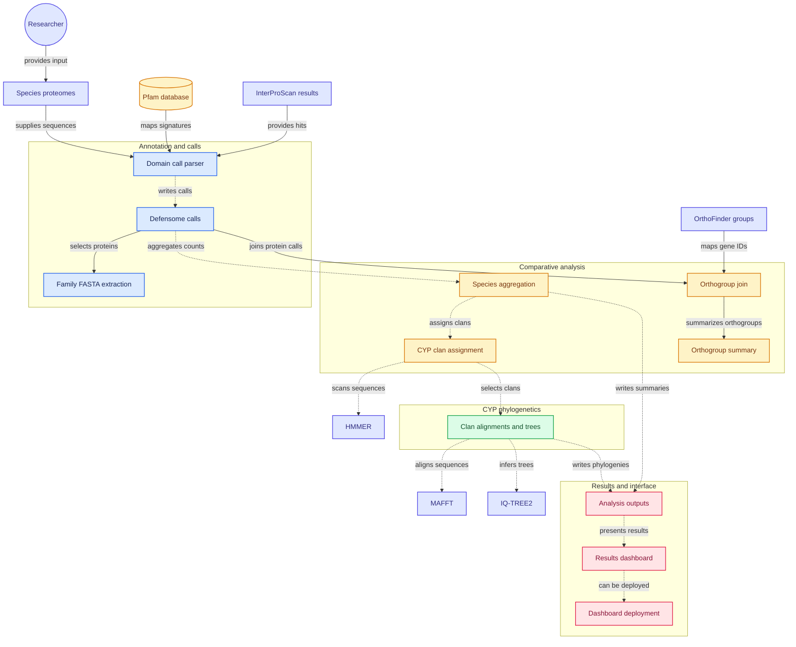

# defensome

Comparative chemical defensome annotation from proteomes.
---

## Quick start

Check what your environment can run first. It takes a second and saves a
failed run thirty samples in:

```bash
python3 defensome.py doctor
```

If HMMER and your Python need incompatible module toolchains, which is common
on Lmod clusters, point at the binaries instead of loading both:

```bash
module load HMMER && export DEFENSOME_HMMSEARCH=$(which hmmsearch) \
                  && export DEFENSOME_HMMBUILD=$(which hmmbuild)
module purge && module load Python
```

Then:

```bash
git clone https://github.com/krishnan-Rama/DEFENSOME && cd DEFENSOME
conda env create -f envs/environment.yml && conda activate defensome

# 1. look at your proteomes; writes a draft sample sheet and stops
bash run_pipeline.sh --proteomes /path/to/proteomes --out results

# 2. check results/samplesheet.tsv, then run everything
bash run_pipeline.sh --proteomes /path/to/proteomes --pfam /db/Pfam-A.hmm \
     --out results --samplesheet results/samplesheet.tsv
```

The first run deliberately stops after `inspect`. Every silent failure this
pipeline has had came from an ID or grouping assumption nobody looked at, so
the assumption is now written to a file you have to approve.

Requirements: Python 3.9+, pandas, numpy. HMMER for `scan`; MAFFT and FastTree
for `cyp` and `trees`; scipy and matplotlib are optional and degrade with a
warning. `defensome.py` embeds its own family map and dashboard, so it runs
from any directory with no sibling files.

---
## Running on SLURM

Three jobs chained by dependency: a collapse job, a scan array with one task
per proteome, and one analysis job for everything downstream.

```bash
# once, on the login node: generate the sample sheet and CHECK it
python3 defensome.py inspect --proteomes /path/to/peps --out results

# edit slurm/config.sh for your partitions, account and modules, then
bash slurm/submit.sh --samplesheet results/samplesheet.tsv \
     --pfam /db/Pfam-A.hmm --out results --drop-utrorf --dry-run
bash slurm/submit.sh --samplesheet results/samplesheet.tsv \
     --pfam /db/Pfam-A.hmm --out results --drop-utrorf
```

`slurm/config.sh` is the only file you should need to edit. It holds the
partitions, resources, and two module-loading functions. There are two because
HMMER and a modern Python stack usually need incompatible compiler toolchains
on EasyBuild/Lmod clusters, and loading both makes Lmod swap GCCcore under one
of them. `load_scan` pairs HMMER with a Python on the *same* GCCcore (the scan
needs no third-party Python packages); `load_analysis` records absolute paths
to HMMER, MAFFT and FastTree first, then loads the Python stack last.

Before submitting anything, `submit.sh` runs a preflight in *both*
environments using those same functions, and installs matplotlib to `--user`
if the analysis Python lacks it. It fails on the login node rather than
thirty jobs later.

**Resuming.** Rerun the identical command. Samples with a finished scan are
skipped, and if every collapsed proteome exists the collapse job is skipped
too. The array reads `results/scan_list.txt`, written at submission, so the
task-to-sample mapping is fixed and auditable.

Inside the analysis job, `annotate` is fail-fast: if it breaks, the job stops
with one message instead of a cascade. Independent steps such as `trees` and
`cyp` record a failure and let the rest finish.

### CYP clans are not optional

`submit.sh` refuses to proceed without a clan-labelled CYP reference, because a
missing one used to mean clans were skipped with a single log line. Pass
`--cyp-refs`, set `CYP_REFS` in `slurm/config.sh`, or pass `--no-cyp` to waive
it deliberately. To add clans to a finished run without rescanning:

```bash
bash slurm/submit.sh --samplesheet results/samplesheet.tsv --pfam /db/Pfam-A.hmm \
     --out results --cyp-refs ref.c80.faa --steps cyp,genetree,dashboard
```

`--steps` submits only the analysis job and runs only the named steps.

## The tree view

The dashboard's Trees tab is built for reading gene trees as evidence about
annotation method. Copies of one gene recovered by DToL, genome-guided and de
novo proteomes should sit together; a clade built from one method alone is a
transcript-only gene, a fragment family, or a contaminant.

- **Rings** for method, species, CYP clan, domain completeness, and any trait,
  each in its own palette so no colour means two things. Legends carry counts.
- **Single-source clades**: every maximal clade of three or more tips sharing
  one method (or one species, or one clan), with a button that zooms to it.
- **Click a branch point** for that clade's composition by method, species,
  clan and completeness, and a flag when it is single-method. Download its tips.
- **Scroll to zoom, drag to pan**, radial or rectangular, cladogram or
  phylogram with a scale bar, FastTree support shown on demand, search that
  highlights matching tips. Labels appear once they would be legible.
- PNG and SVG export of the current view.

A 3,000-tip tree renders in about 130 ms: all branches are one path, each ring
colour is one path, and hit testing is geometric rather than per-element.

`test/test_trees.sh` checks this against a fixture with a known answer (twelve
orthologous clades plus three injected de novo-only clades that must be found
exactly), then opens the dashboard in a real headless browser, moves a real
mouse to computed tip positions before and after wheel zoom and drag pan in
both layouts, and asserts the tooltip names the right tip.


## Prerequisites: what to upload, what the pipeline fetches

Nothing needs to come off your HPC. The repository is self-contained except
for one database, and the pipeline can fetch that itself.

| what | size | how |
|---|---|---|
| Pfam-A.hmm | ~300 MB gz | `--download-pfam`, or `--pfam /path/to/Pfam-A.hmm[.gz]` |
| the defensome HMM subset | ~1 MB | built by `setup`; **this** is what gets searched |
| CYP clan reference | ~1 MB | build from ICPD with `cyp-refs`; see `README_datasets.md` |
| HMMER, MAFFT, FastTree | – | `envs/environment.yml`, or cluster modules |

**Do not commit Pfam-A to the repository.** `setup` extracts only the ~45
accessions the map uses into `<out>/db/defensome.hmm`, about 1 MB, and writes
`MANIFEST.tsv` recording the release. Searching the subset gives identical
calls, because `hmmsearch` scores each HMM independently and `--cut_ga` uses
per-family thresholds, while E-values depend on the number of target
sequences rather than on how many models are searched. It is also dramatically
faster: the full-Pfam architecture pass is now optional (`--full-architecture`)
and runs only on proteins that already hit a defensome family.

The one file worth committing is your clan reference if you want other people
to reproduce your CYP clans exactly. It is about 1 MB and gzips well. Commit it
under `db/` with the ICPD citation (Wu et al. 2025, *Mol Ecol Resour* 25:e14070)
in the README, and note ICPD's terms.

## Subcommands

| | |
|---|---|
| `doctor` | report which tools and libraries are present and which steps can run |
| `setup` | extract the defensome HMMs from Pfam-A and record the release |
| `short-orfs` | recover proteins the ORF caller discarded, from the transcripts |
| `inspect` | examine headers, propose a gene-ID rule, write a draft sample sheet |
| `collapse` | longest protein per gene, per the sample sheet |
| `scan` | `hmmsearch` against Pfam-A with `--cut_ga` |
| `annotate` | apply the family architecture rules, build count matrices |
| `qc` | annotation quality from low-copy control families |
| `compare` | paired comparison across annotation methods (raw by default; `--complete-only`, `--exclude`, `--per10k`) |
| `domains` | per-protein domain architecture and completeness |
| `extract` / `trees` | per-family FASTA, MAFFT + FastTree |
| `cyp` / `cyp-refs` / `cyp-benchmark` | CYP clan assignment, reference building, hold-out accuracy |
| `icpd-evidence` / `chem-triage` | triage external functional datasets |
| `report` / `dashboard` | figures, and one self-contained HTML file |
| `assets` / `dataset-help` | write embedded files out, dataset guidance |

---

## The family map

`defensome_map.tsv`, one row per family, editable:

| column | meaning |
|---|---|
| `pfam_ids` | comma-separated Pfam accessions |
| `rule` | `ANY` = at least one; `ALL` = every one, in the same protein |
| `min_cov` | minimum fraction of the HMM aligned, over merged non-overlapping segments |
| `min_len` | minimum protein length |
| `tier` | `CORE` = safe to compare; `BROAD` = huge superfamily, counts inflated |

`ALL` is what stops a lone GST_N domain being called a GST, or a bare P-loop
NTPase being called an ABC transporter. `python3 defensome.py assets --write .`
writes the map out; a file next to the script overrides the embedded copy.

---



## Licence

MIT. See `LICENSE`.
